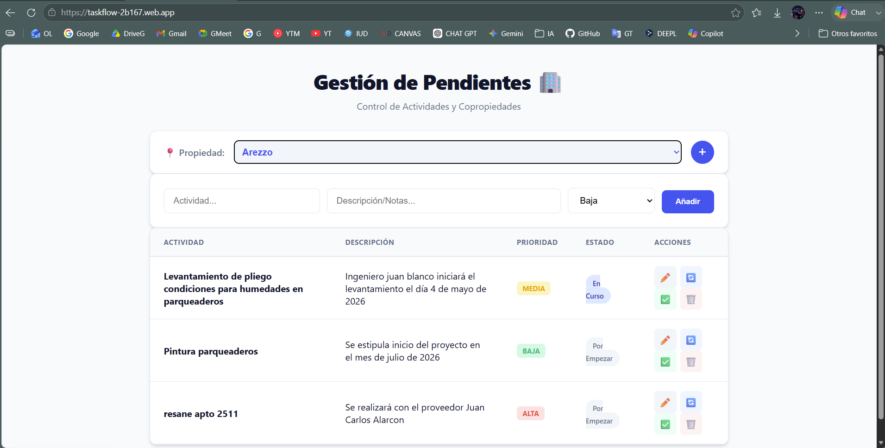

# TaskFlow Copropiedades: Software Journey Arquitectonico



## Proposito de la documentacion

Esta documentacion narra el Software Journey de TaskFlow Copropiedades como una historia tecnica: primero, las decisiones que permitieron construir rapidamente un MVP; despues, la forma en que la complejidad comenzo a emerger; finalmente, el veredicto retrospectivo usando los conceptos de John Ousterhout.

El objetivo no es rehacer el analisis ni inventar una arquitectura que el repositorio no tiene. El objetivo es explicar, con evidencia real, como una aplicacion pequena y funcional puede validar valor rapidamente y, al mismo tiempo, acumular senales tempranas de complejidad.

La lectura usa cinco conceptos de Ousterhout:

- Deep Modules
- Shallow Modules
- Information Hiding
- Information Leakage
- Change Amplification

Todas las conclusiones se apoyan en archivos existentes del repositorio. Cuando algo no puede demostrarse con evidencia local, se declara explicitamente.

## El punto de partida: una decision pragmatica

El proyecto nace como una aplicacion para registrar y gestionar pendientes asociados a copropiedades. El `client-brief.md` define una necesidad concreta: una herramienta rapida, movil y con persistencia offline para un supervisor de copropiedades. La seleccion tecnologica declarada en ese brief es deliberadamente simple:

- Vanilla JavaScript, HTML5 y CSS3 para el frontend.
- Firebase Firestore con persistencia en IndexedDB para datos.
- Firebase Hosting para publicacion.

Evidencia: `client-brief.md`.

Esta decision inicial redujo el costo de entrada. No se introdujo un framework, un backend propio ni un pipeline de build. Esa simplicidad permitio construir un tracer bullet funcional: una pantalla que conecta interfaz, Firestore, persistencia offline y renderizado responsive.

## El sistema resultante

El repositorio evidencia una aplicacion ejecutable concentrada en tres archivos:

- `public/index.html`: estructura visual de la pantalla, formulario, tabla y modal.
- `public/app.js`: inicializacion Firebase, acceso a Firestore, estado de pantalla, listeners, renderizado y operaciones CRUD.
- `public/style.css`: estilos, tabla, responsive y modal.

La aplicacion se publica con Firebase Hosting. `firebase.json` declara que la carpeta publica es `public` y que todas las rutas se reescriben hacia `/index.html`:

```json
"public": "public",
"rewrites": [
  {
    "source": "**",
    "destination": "/index.html"
  }
]
```

Evidencia: `firebase.json`.

El runtime importa Firebase desde CDN:

```js
import { initializeApp } from "https://www.gstatic.com/firebasejs/10.8.0/firebase-app.js";
import { getFirestore, collection, addDoc, serverTimestamp, onSnapshot, query, orderBy, enableIndexedDbPersistence, where, doc, updateDoc, deleteDoc } from "https://www.gstatic.com/firebasejs/10.8.0/firebase-firestore.js";
```

Evidencia: `public/app.js`.

## La tesis del journey

TaskFlow muestra una evolucion comun en productos pequenos: las mismas decisiones que aceleran el MVP pueden convertirse en fuentes de complejidad cuando el sistema empieza a crecer.

El proyecto se sostiene inicialmente gracias a deep modules externos: Firestore, persistencia offline y Firebase Hosting. Estos modulos ofrecen interfaces pequenas que esconden una funcionalidad amplia. Sin embargo, el codigo propio no desarrolla todavia modulos profundos equivalentes para dominio, persistencia o renderizado.

El resultado es una arquitectura funcional pero fragil: `public/app.js` concentra muchas decisiones y permite que detalles de Firestore, HTML, CSS y dominio se conozcan entre si. Esa filtracion produce information leakage y, como consecuencia practica, change amplification.

## Recorrido de la documentacion

1. [Seccion 1: Tracer Bullet](./seccion1-tracer-bullet.md)
2. [Seccion 2: Anatomia de la Complejidad](./seccion2-anatomia-complejidad.md)
3. [Seccion 3: Veredicto Retrospectivo](./seccion3-veredicto-retrospectivo.md)

## Estructura final de la carpeta `docs`

```text
docs/
├── index.md
├── seccion1-tracer-bullet.md
├── seccion2-anatomia-complejidad.md
└── seccion3-veredicto-retrospectivo.md
```
