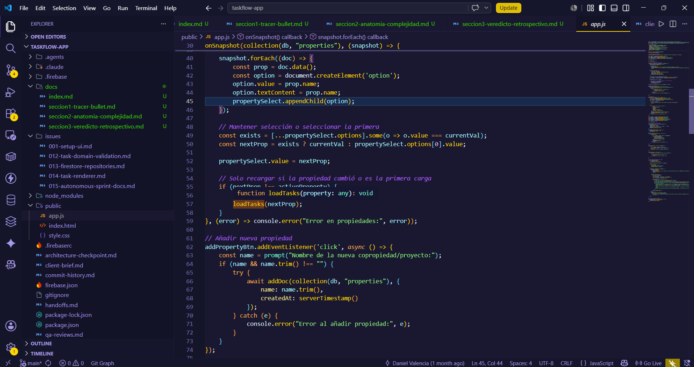

# Seccion 1: Tracer Bullet



## Inicio del journey: validar antes de sofisticar

El primer momento del journey de TaskFlow es pragmatico. El `client-brief.md` describe una necesidad operativa concreta: registrar tareas y hallazgos durante recorridos de supervision en copropiedades, incluso en condiciones de conectividad limitada. Desde el inicio, el valor esperado no dependia de una arquitectura sofisticada, sino de lograr un flujo rapido, movil y persistente.

Por eso, las decisiones iniciales fueron ligeras:

- Frontend con Vanilla JavaScript, HTML5 y CSS3.
- Backend/base de datos con Firebase Firestore y persistencia en IndexedDB.
- Hosting mediante Firebase Hosting.

Evidencia: `client-brief.md`.

Esta combinacion permitio construir un tracer bullet: un recorrido funcional estrecho, pero completo, que atraviesa la interfaz, la persistencia y el renderizado. En terminos de Ousterhout, el proyecto pudo avanzar rapido porque delego parte de la complejidad en deep modules externos, especialmente Firestore y Firebase Hosting.

## El primer corte vertical del producto

El flujo minimo verificable es el siguiente:

1. seleccionar o crear una propiedad;
2. crear una tarea con titulo, descripcion y prioridad;
3. visualizar la tarea en una tabla;
4. editar la tarea;
5. cambiar su estado;
6. eliminarla.

Ese flujo existe en el codigo actual y se distribuye entre `public/index.html`, `public/app.js` y `public/style.css`. No hay evidencia de rutas internas, framework frontend ni backend propio.

## Primera decision: una sola pantalla de trabajo

`public/index.html` define una pantalla unica. El archivo contiene:

- selector de propiedad: `select#current-property`;
- boton para agregar propiedad: `button#add-property-btn`;
- formulario de tarea: `#task-title`, `#task-desc`, `#task-priority`, `#add-btn`;
- tabla de tareas: `tbody#task-list`;
- modal de edicion: `#edit-modal`, `#edit-title`, `#edit-desc`, `#edit-priority`.

Evidencia: `public/index.html`.

Esta decision favorecio la velocidad. Una pantalla unica reduce coordinacion inicial, evita routing y permite validar el flujo principal sin construir una jerarquia de componentes.

La lectura desde Ousterhout es doble. Como decision de MVP, la interfaz es simple y util. Como diseno evolutivo, todavia no forma un deep module propio: los IDs del DOM son conocidos directamente por `public/app.js`, de modo que la estructura visual no esta completamente oculta. Hay poco information hiding entre HTML y JavaScript.

## Segunda decision: Firebase como deep module externo

`public/app.js` importa Firebase App y Firestore desde CDN. Luego inicializa la aplicacion:

```js
const app = initializeApp(firebaseConfig);
const db = getFirestore(app);
```

Evidencia: `public/app.js`.

Tambien habilita persistencia offline:

```js
enableIndexedDbPersistence(db).catch(err => console.error("Error persistencia:", err.code));
```

Evidencia: `public/app.js`.

Esta decision fue clave para validar el MVP. Con una llamada, la aplicacion delega en Firestore la persistencia local en IndexedDB y la sincronizacion posterior. Segun Ousterhout, esto es un deep module: la interfaz es pequena, pero la funcionalidad oculta es amplia.

No hay evidencia de que el repositorio implemente manualmente IndexedDB, reconciliacion offline o sincronizacion propia. Esa ausencia no es una debilidad en esta etapa; es precisamente el beneficio de apoyarse en un modulo profundo existente.

## Tercera decision: propiedades en tiempo real

La aplicacion escucha la coleccion `properties`:

```js
onSnapshot(collection(db, "properties"), (snapshot) => { ... });
```

Evidencia: `public/app.js`.

Por cada documento, el codigo crea una opcion del selector usando `prop.name`:

```js
option.value = prop.name;
option.textContent = prop.name;
```

Evidencia: `public/app.js`.

En el journey inicial, esto simplifica el modelo: el usuario ve un nombre de propiedad y el sistema usa ese mismo valor para filtrar tareas. Esta simplicidad permite avanzar rapido, pero introduce una primera senal de information leakage. El nombre visible de la propiedad funciona tambien como identidad tecnica. La UI, el dominio y Firestore comparten el mismo string sin una abstraccion que oculte esa decision.

## Cuarta decision: crear propiedades sin capa intermedia

El boton `add-property-btn` abre un `prompt` y crea un documento:

```js
await addDoc(collection(db, "properties"), {
  name: name.trim(),
  createdAt: serverTimestamp()
});
```

Evidencia: `public/app.js`.

Para un MVP, esta solucion es suficiente: reduce friccion y valida que una propiedad pueda aparecer en tiempo real. Pero desde Ousterhout, la funcion es un shallow module. No oculta reglas de dominio, no centraliza validaciones de propiedad, no maneja duplicados y expone directamente la coleccion Firestore dentro del handler de UI.

## Quinta decision: crear tareas directamente desde el DOM

El handler del boton `add-btn` lee los campos del formulario:

```js
const title = document.getElementById('task-title').value;
const desc = document.getElementById('task-desc').value;
const priority = document.getElementById('task-priority').value;
const property = propertySelect.value;
```

Evidencia: `public/app.js`.

La validacion actual comprueba solo titulo y propiedad:

```js
if (!title || !property) {
  alert("Asegurate de escribir una actividad y seleccionar una propiedad.");
  return;
}
```

Evidencia: `public/app.js`.

Luego guarda el documento:

```js
await addDoc(collection(db, "tasks"), {
  title,
  description: desc,
  priority,
  property,
  status: "por empezar",
  createdAt: serverTimestamp()
});
```

Evidencia: `public/app.js`.

Esta parte del journey muestra el intercambio central del MVP: menos capas, mas velocidad. La tarea se crea sin pasar por un modelo de dominio ni un repository. La consecuencia arquitectonica es information leakage: el handler de UI conoce el esquema exacto del documento Firestore. Tambien aparece change amplification potencial: si el modelo de tarea cambia, ese cambio impacta directamente el codigo de pantalla.

## Sexta decision: una funcion central para cargar y renderizar tareas

El flujo de tareas se concentra en `loadTasks(property)`:

```js
function loadTasks(property) {
  if (!property) return;
  if (unsubscribe) unsubscribe();
  ...
}
```

Evidencia: `public/app.js`.

La consulta filtra por propiedad y ordena por fecha de creacion:

```js
const q = query(
  collection(db, "tasks"),
  where("property", "==", property),
  orderBy("createdAt", "desc")
);
```

Evidencia: `public/app.js`.

Esta decision acelera la implementacion porque todo el comportamiento visible de la lista vive en un solo lugar. Tambien muestra la diferencia entre un deep module externo y un shallow module propio. Firestore ofrece `query`, `where` y `orderBy` como interfaz compacta para una operacion compleja. En cambio, `loadTasks(property)` mezcla consulta, suscripcion, renderizado, clases CSS, estados vacios y errores de infraestructura. La funcion tiene mucho codigo, pero no oculta bien la complejidad.

## Septima decision: renderizar filas con `innerHTML`

Cada tarea se renderiza mediante `tr.innerHTML`:

```js
tr.innerHTML = `
  <td data-label="Actividad"><strong>${task.title}</strong></td>
  <td data-label="Descripcion">${task.description || '-'}</td>
  <td data-label="Prioridad"><span class="priority-tag priority-${task.priority}">${task.priority}</span></td>
  <td data-label="Estado"><span class="status-pill status-${statusClass}">${statusLabel}</span></td>
  ...
`;
```

Evidencia: `public/app.js`.

Los botones invocan funciones globales:

```html
onclick="editTask(...)"
onclick="updateStatus(...)"
onclick="deleteTask(...)"
```

Evidencia: `public/app.js`.

En el MVP, esto resuelve rapidamente el render y las acciones. En la lectura de Ousterhout, es el punto donde la complejidad comienza a hacerse visible: el renderer conoce estructura HTML, clases CSS, atributos responsive, funciones globales, strings de estado y campos de Firestore. Es un caso claro de information leakage.

## Octava decision: responsive desde CSS

`public/style.css` define clases de prioridad:

```css
.priority-alta { ... }
.priority-media { ... }
.priority-baja { ... }
```

Evidencia: `public/style.css`.

Tambien define estados:

```css
.status-en-curso { ... }
.status-finalizado { ... }
```

Evidencia: `public/style.css`.

La tabla se adapta a pantallas pequenas mediante `data-label`:

```css
td::before {
  content: attr(data-label);
}
```

Evidencia: `public/style.css`.

Esta solucion permite validar movilidad, que era un objetivo del brief. Al mismo tiempo, crea un contrato implicito entre JavaScript y CSS: el renderer debe producir `data-label` para que el responsive funcione. De nuevo aparece information leakage.

## Alcance demostrado y no demostrado

Demostrado por el repositorio:

- SPA estatica con Firebase Hosting.
- Uso de Firestore en tiempo real.
- Persistencia offline mediante `enableIndexedDbPersistence`.
- CRUD de propiedades y tareas desde el cliente.
- UI responsive basada en CSS.

No demostrado por el repositorio:

- Autenticacion Google implementada. El brief la exige, pero `public/app.js` no importa Firebase Auth ni contiene `getAuth`, `GoogleAuthProvider`, `signInWithPopup` u `onAuthStateChanged`.
- Service worker o manifest PWA. El brief habla de PWA, pero en el arbol actual no hay evidencia de `manifest` ni service worker.
- Suite automatizada de tests. `package.json` contiene un script `test` que reporta `"Error: no test specified"`.

## Lectura del tracer bullet

El tracer bullet cumplio su proposito: hizo visible el producto completo con una inversion tecnica baja. Esa es la parte positiva del journey. Pero tambien dejó senales claras para la siguiente etapa: las decisiones de dominio, persistencia, UI y CSS quedaron demasiado cerca unas de otras. En el lenguaje de Ousterhout, el sistema valido rapido porque uso deep modules externos, pero empezo a acumular complejidad porque no creo deep modules propios.

