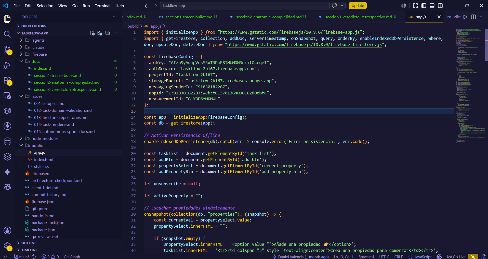
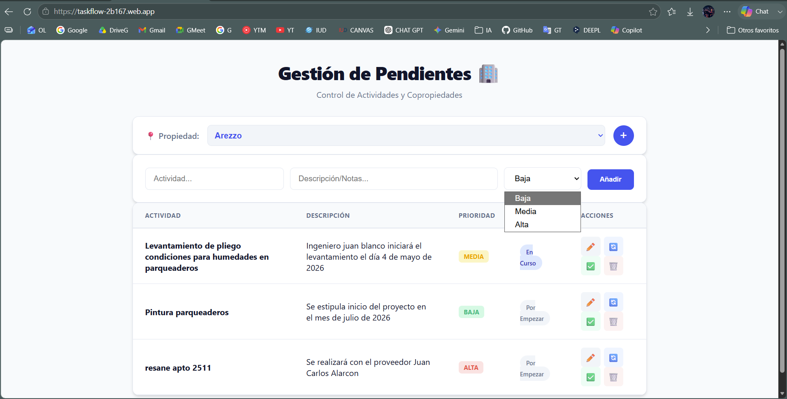

ANATOMIA:
# Seccion 2: Anatomia de la Complejidad



## Del MVP funcional a la complejidad emergente

La complejidad de TaskFlow no aparece porque el repositorio sea grande. Aparece porque las decisiones iniciales, razonables para validar el MVP, empiezan a conectar demasiadas capas entre si. Esta seccion revisa esa evolucion usando la terminologia de John Ousterhout.

Ousterhout plantea que un buen diseno reduce complejidad mediante modulos profundos, information hiding y separacion clara de decisiones. Cuando esas propiedades no existen, aparecen shallow modules, information leakage y change amplification.

## Deep Modules: la base que permitio avanzar rapido

### 1. Firebase Firestore SDK

El SDK de Firestore se usa mediante una interfaz compacta:

```js
import { getFirestore, collection, addDoc, serverTimestamp, onSnapshot, query, orderBy, enableIndexedDbPersistence, where, doc, updateDoc, deleteDoc } from "https://www.gstatic.com/firebasejs/10.8.0/firebase-firestore.js";
```

Evidencia: `public/app.js`.

Con llamadas como `addDoc`, `onSnapshot`, `query`, `where`, `orderBy`, `updateDoc` y `deleteDoc`, el sistema obtiene persistencia, consultas, documentos, timestamps de servidor y suscripciones en tiempo real. La aplicacion no implementa protocolos de red, reconexion, cache ni serializacion.

Este es un deep module en el sentido de Ousterhout: una interfaz pequena ofrece una funcionalidad amplia. Su profundidad fue una razon clave para que el MVP pudiera validarse rapidamente.

### 2. Persistencia offline de Firestore

```js
enableIndexedDbPersistence(db).catch(err => console.error("Error persistencia:", err.code));
```

Evidencia: `public/app.js`.

La persistencia offline es una necesidad del brief. El repositorio la aborda delegando en Firestore. Una sola llamada habilita comportamiento basado en IndexedDB. No hay evidencia de almacenamiento local manual, reconciliacion propia ni sincronizacion escrita por el proyecto.

Desde Ousterhout, este es information hiding efectivo: una decision tecnica compleja queda oculta detras de una interfaz simple.

### 3. Firebase Hosting

`firebase.json` declara:

```json
"hosting": {
  "site": "taskflow-2b167",
  "public": "public",
  "rewrites": [
    {
      "source": "**",
      "destination": "/index.html"
    }
  ]
}
```

Evidencia: `firebase.json`.

Firebase Hosting oculta servidor web, despliegue, serving estatico y fallback SPA. El proyecto expresa el comportamiento mediante configuracion declarativa. Como deep module operacional, permitio publicar sin construir infraestructura propia.

### 4. Tokens CSS globales

```css
:root {
  --primary: #2563eb;
  --primary-hover: #1d4ed8;
  --bg: #f8fafc;
  --surface: #ffffff;
  --text-main: #0f172a;
  --text-muted: #64748b;
  --border: #e2e8f0;
}
```

Evidencia: `public/style.css`.

Estos tokens centralizan decisiones visuales. No convierten todo el CSS en un modulo profundo, pero si ocultan valores concretos detras de nombres reutilizables. Es un deep module parcial: reduce duplicacion visual, aunque no centraliza prioridades ni estados.

## Shallow Modules: cuando la interfaz no oculta suficiente

### 1. `window.updateStatus`

```js
window.updateStatus = async (id, newStatus) => {
  try {
    const taskRef = doc(db, "tasks", id);
    await updateDoc(taskRef, { status: newStatus });
  } catch (e) {
    console.error("Error al actualizar estado:", e);
  }
};
```

Evidencia: `public/app.js`.

Este handler permitio cambiar estados rapidamente desde botones. Pero como modulo, es shallow: la interfaz recibe el ID Firestore y el string exacto del estado. No oculta transiciones validas, reglas de dominio ni permisos.

### 2. `window.deleteTask`

```js
window.deleteTask = async (id) => {
  if (confirm("Estas seguro de eliminar esta actividad?")) {
    try {
      await deleteDoc(doc(db, "tasks", id));
    } catch (e) {
      console.error("Error al eliminar:", e);
    }
  }
};
```

Evidencia: `public/app.js`.

La funcion mezcla confirmacion de UI y operacion Firestore. Su interfaz no encapsula una politica de borrado; apenas envuelve `deleteDoc`. Por eso, segun Ousterhout, es una interfaz superficial.

### 3. `window.editTask`

```js
window.editTask = (id, title, desc, priority) => {
  currentEditId = id;
  editTitle.value = title;
  editDesc.value = (desc === '-' || !desc) ? '' : desc;
  editPriority.value = priority;
  editModal.style.display = 'flex';
};
```

Evidencia: `public/app.js`.

El renderer debe conocer que esta funcion necesita `id`, `title`, `desc` y `priority`. La interfaz refleja la estructura interna del modal y de la tarea. Esto reduce information hiding y convierte la funcion en shallow module.

### 4. `loadTasks(property)`

```js
function loadTasks(property) { ... }
```

Evidencia: `public/app.js`.

Esta funcion es el punto donde la complejidad emergente se vuelve mas visible. Contiene:

- cancelacion de la suscripcion anterior;
- consulta Firestore;
- renderizado de empty state;
- generacion de HTML;
- calculo de clases CSS;
- botones con `onclick`;
- manejo de error de indice Firestore.

El `architecture-checkpoint.md` tambien identifica `public/app.js`, especialmente `loadTasks()`, como el principal punto de acoplamiento.

Evidencia: `architecture-checkpoint.md`.

El tamano de `loadTasks()` no la vuelve profunda. En Ousterhout, un modulo es profundo cuando una interfaz pequena oculta una complejidad significativa. Aqui la complejidad queda concentrada, pero no queda bien oculta.

## Information Hiding: lo que si queda encapsulado

### 1. Alcance de modulo ES

`index.html` carga `app.js` como modulo:

```html
<script src="app.js" type="module"></script>
```

Evidencia: `public/index.html`.

Esto hace que variables como `unsubscribe`, `activeProperty` y `currentEditId` no sean globales por defecto:

```js
let unsubscribe = null;
let activeProperty = "";
let currentEditId = null;
```

Evidencia: `public/app.js`.

Hay information hiding parcial: el estado interno queda dentro del modulo. La limitacion es que varias funciones se exponen manualmente en `window`, lo que reabre parte de esa frontera.

### 2. Firestore oculta red y tiempo real

```js
unsubscribe = onSnapshot(q, (snapshot) => { ... });
```

Evidencia: `public/app.js`.

La aplicacion recibe snapshots sin implementar reconexion, comunicacion, serializacion o cache. Este es uno de los mejores ejemplos de information hiding real en el proyecto.

### 3. CSS custom properties ocultan decisiones visuales

El uso de `var(--primary)`, `var(--surface)` y `var(--border)` permite que multiples reglas visuales dependan de una fuente comun.

Evidencia: `public/style.css`.

Este ocultamiento es parcial. Las prioridades y los estados no estan igualmente encapsulados, lo que explica parte del change amplification posterior.

### 4. Firebase Hosting oculta servidor y routing

`firebase.json` define hosting y rewrites sin que el proyecto tenga un servidor propio.

Evidencia: `firebase.json`.

La complejidad operacional queda oculta detras de configuracion.



## Information Leakage: donde la complejidad empieza a propagarse

### 1. Configuracion Firebase dentro de la pantalla

`firebaseConfig` esta en `public/app.js`, el mismo archivo que administra DOM, render y eventos.

Evidencia: `public/app.js`.

La infraestructura se filtra hacia la capa de pantalla. Esta decision fue practica al inicio, pero reduce separacion conceptual.

### 2. Colecciones Firestore conocidas por handlers UI

```js
collection(db, "properties")
collection(db, "tasks")
```

Evidencia: `public/app.js`.

No existe una capa repository que oculte nombres fisicos de colecciones. La UI conoce directamente la persistencia.

### 3. Esquema de documentos en la pantalla

El handler de creacion conoce el documento completo:

```js
title,
description: desc,
priority,
property,
status: "por empezar",
createdAt: serverTimestamp()
```

Evidencia: `public/app.js`.

El renderer tambien conoce `task.title`, `task.description`, `task.priority` y `task.status`. El esquema de Firestore se filtra hacia la UI.

### 4. Identidad de propiedad como nombre visible

```js
option.value = prop.name;
option.textContent = prop.name;
```

Evidencia: `public/app.js`.

La tarea guarda ese valor como `property`, y la consulta lo usa:

```js
where("property", "==", property)
```

Evidencia: `public/app.js`.

El nombre humano de la propiedad tambien funciona como identificador tecnico. Esta decision simplifico el MVP, pero crea information leakage entre UI, dominio y persistencia.

### 5. Prioridades repartidas entre HTML, JS y CSS

HTML:

```html
<option value="baja">Baja</option>
<option value="media">Media</option>
<option value="alta">Alta</option>
```

Evidencia: `public/index.html`.

JS:

```js
priority-${task.priority}
```

Evidencia: `public/app.js`.

CSS:

```css
.priority-alta
.priority-media
.priority-baja
```

Evidencia: `public/style.css`.

La decision de dominio "prioridades validas" se filtra en tres capas.

### 6. Estados repartidos entre JS y CSS

JS:

```js
status: "por empezar"
updateStatus(..., 'en curso')
updateStatus(..., 'finalizado')
```

Evidencia: `public/app.js`.

CSS:

```css
.status-en-curso
.status-finalizado
```

Evidencia: `public/style.css`.

El codigo transforma espacios en guiones:

```js
const statusClass = statusLabel.replace(/\s+/g, '-');
```

Evidencia: `public/app.js`.

El texto del estado queda acoplado al nombre de clase CSS.

### 7. Renderer acoplado al responsive

JS genera `data-label`:

```html
<td data-label="Actividad">
```

Evidencia: `public/app.js`.

CSS lo consume:

```css
td::before {
  content: attr(data-label);
}
```

Evidencia: `public/style.css`.

La regla responsive depende de un contrato implicito que el renderer debe recordar.

### 8. `onclick` inline y funciones globales

```html
onclick="editTask(...)"
onclick="updateStatus(...)"
onclick="deleteTask(...)"
```

Evidencia: `public/app.js`.

El HTML generado conoce nombres globales de funciones. La frontera entre render y controlador queda debilitada.

### 9. Escape manual dentro del render

```js
task.title.replace(/'/g, "\\'")
```

Evidencia: `public/app.js`.

La funcion de render conoce detalles de escape para strings embebidos en atributos `onclick`. Se mezclan datos, HTML y JavaScript.

### 10. Error de indice Firestore mostrado en UI

```js
alert("Falta crear un indice en Firebase para esta consulta...");
```

Evidencia: `public/app.js`.

Un detalle interno de infraestructura aparece como mensaje de usuario. Esta es information leakage desde persistencia hacia interfaz.

### 11. `colspan="5"` duplicando estructura de tabla

```js
<tr><td colspan="5" ...>
```

Evidencia: `public/app.js`.

La tabla real tiene cinco columnas en `public/index.html`. El numero queda duplicado en JavaScript.

### 12. Versiones Firebase en dos mecanismos

`package.json` declara:

```json
"firebase": "^12.12.1"
```

Evidencia: `package.json`.

Pero `public/app.js` importa Firebase `10.8.0` desde CDN. Esto crea leakage operacional entre dependencia npm y dependencia runtime.

## Change Amplification: el costo de cambiar despues

### 1. Agregar una prioridad

Agregar una prioridad como "critica" requeriria tocar:

- `public/index.html` en el formulario de creacion;
- `public/index.html` en el modal de edicion;
- `public/style.css` para `.priority-critica`;
- `public/app.js` porque el renderer forma `priority-${task.priority}`.

Un cambio conceptual se propaga a varias capas. Eso es change amplification.

### 2. Cambiar estados de tarea

Modificar estados exige tocar:

- estado inicial `"por empezar"` en `public/app.js`;
- botones `updateStatus(..., 'en curso')` y `updateStatus(..., 'finalizado')`;
- clases `.status-en-curso` y `.status-finalizado` en `public/style.css`;
- posiblemente la logica `statusLabel.replace(/\s+/g, '-')`.

La causa es la ausencia de una fuente unica de verdad para estados.

### 3. Cambiar identidad de propiedad

Si el proyecto migrara de `prop.name` a ID de documento, habria que modificar:

- `option.value = prop.name`;
- guardado de `property` en tareas;
- consulta `where("property", "==", property)`;
- logica de seleccion activa.

La identidad de propiedad esta filtrada en varios puntos.

### 4. Agregar autenticacion Google

El brief exige autenticacion Google, pero el codigo no la implementa. No hay evidencia de `getAuth`, `GoogleAuthProvider`, `signInWithPopup` u `onAuthStateChanged`.

Agregarla implicaria tocar:

- imports Firebase;
- inicializacion;
- gating de UI;
- reglas de acceso a Firestore fuera del codigo actual;
- posiblemente queries por usuario.

Esta conclusion sobre impacto es una inferencia arquitectonica basada en la ausencia de capa de autenticacion y en la concentracion actual de `app.js`; no hay codigo implementado de auth que pueda analizarse.

### 5. Cambiar estructura de tabla

La tabla aparece en:

- `public/index.html`, columnas de la tabla;
- `public/app.js`, HTML de filas;
- `public/app.js`, `colspan="5"` en empty states;
- `public/style.css`, responsive basado en `td::before` y `data-label`.

Un cambio visual simple puede requerir coordinacion en tres archivos.

## Diagnostico de la segunda etapa del journey

El MVP no fracaso arquitectonicamente; cumplio su funcion. La complejidad emerge porque el codigo propio no desarrollo todavia deep modules que oculten decisiones del dominio, del acceso a datos y del renderizado.

El repositorio contiene issues que reconocen esta direccion de mejora: `issues/012-task-domain-validation.md`, `issues/013-firestore-repositories.md` y `issues/014-task-renderer.md`. Sin embargo, en el arbol actual esas extracciones no existen como codigo ejecutable; estan documentadas como plan o simulacion.

La anatomia de la complejidad es clara: los deep modules externos aceleraron la validacion; los shallow modules propios dejaron pasar information leakage; esa filtracion produjo change amplification.

