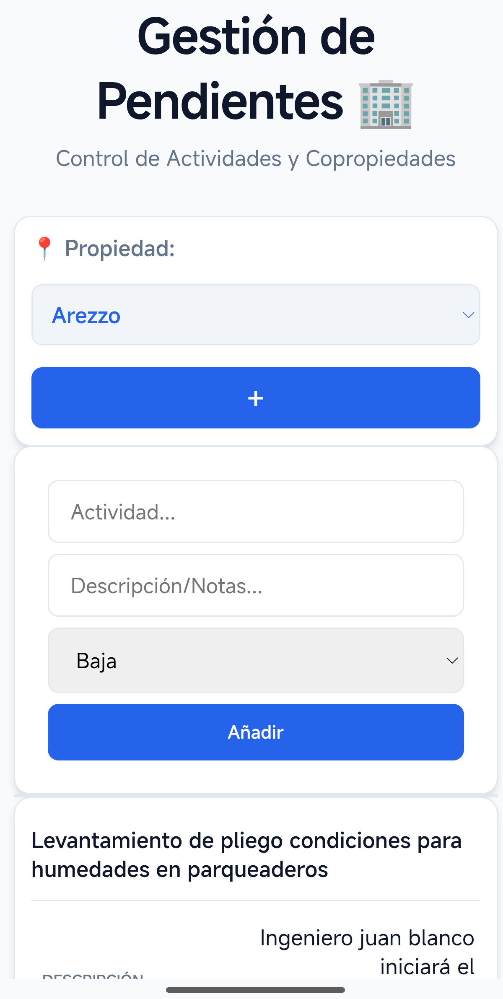

# Seccion 3: Veredicto Retrospectivo

## Veredicto general del journey

TaskFlow Copropiedades es un MVP funcional que tomo decisiones correctas para su primera etapa: usar Vanilla JS, Firestore y Firebase Hosting permitio validar rapidamente un flujo completo sin construir infraestructura innecesaria. Esa es la primera conclusion del journey.

La segunda conclusion es arquitectonica: el proyecto ya muestra senales claras de complejidad emergente. No porque sea grande, sino porque varias decisiones importantes quedaron repartidas entre HTML, JavaScript, CSS y Firestore.

Desde John Ousterhout, el veredicto es:

- Los deep modules mas fuertes son externos: Firestore, persistencia offline y Firebase Hosting.
- Los modulos propios son mayoritariamente shallow modules: handlers globales, render embebido y operaciones Firestore mezcladas con UI.
- La fuente dominante de complejidad es information leakage.
- El efecto practico de esa filtracion es change amplification.

## Lo que las decisiones iniciales lograron

### 1. Validacion rapida del MVP

La aplicacion conecta propiedades y tareas de punta a punta:

- `properties` se escucha con `onSnapshot`.
- `tasks` se crea con `addDoc`.
- tareas por propiedad se consultan con `where("property", "==", property)`.
- estados se actualizan con `updateDoc`.
- tareas se eliminan con `deleteDoc`.

Evidencia: `public/app.js`.

Esto demuestra integracion real. El proyecto no se quedo en un prototipo visual; conecto interfaz, datos y actualizacion en tiempo real.

### 2. Aprovechamiento de deep modules externos

Firestore permite crear, consultar, escuchar, actualizar y eliminar documentos con una interfaz compacta.

Evidencia: `public/app.js`.

`enableIndexedDbPersistence(db)` aporta persistencia offline sin implementar IndexedDB manualmente.

Evidencia: `public/app.js`.

Firebase Hosting publica la SPA con configuracion declarativa en `firebase.json`.

Evidencia: `firebase.json`.

Desde Ousterhout, estas decisiones fueron saludables para el MVP: delegaron complejidad en modulos profundos y permitieron que el equipo se enfocara en validar el flujo.

### 3. Bajo costo inicial de arquitectura

El sistema no introduce React, Vite, backend propio ni una arquitectura por capas compleja. El `architecture-checkpoint.md` indica que mantener Vanilla JS y Firebase CDN fue una decision aceptada para el tamano actual del proyecto.

Evidencia: `architecture-checkpoint.md`.

Esta decision redujo complejidad esencial inicial. En un MVP, no agregar capas innecesarias tambien es una forma de buen diseno.

### 4. Information hiding parcial

El uso de `type="module"` evita que todo el estado sea global por defecto. Variables como `unsubscribe`, `activeProperty` y `currentEditId` viven dentro del modulo, aunque algunas funciones se exponen explicitamente en `window`.

Evidencia: `public/index.html` y `public/app.js`.

El CSS tambien centraliza algunos valores visuales mediante custom properties en `:root`.

Evidencia: `public/style.css`.

Estos mecanismos no resuelven toda la complejidad, pero muestran que el repositorio si contiene algunos ejemplos de information hiding.

## Donde la complejidad comenzo a emerger

### 1. `public/app.js` se convirtio en punto de concentracion

El archivo contiene:

- imports e inicializacion Firebase;
- configuracion del proyecto Firebase;
- acceso directo a Firestore;
- listeners DOM;
- estado de pantalla;
- validacion minima;
- renderizado de filas;
- modal de edicion;
- funciones globales;
- manejo de errores.

Evidencia: `public/app.js`.

En terminos de Ousterhout, esta concentracion no convierte a `app.js` en un deep module. Un modulo profundo oculta complejidad detras de una interfaz simple. Aqui la complejidad esta expuesta y entrelazada dentro del archivo.

### 2. El dominio no tiene fuente unica de verdad

Prioridades:

- aparecen en `public/index.html`;
- se usan en `public/app.js`;
- tienen clases en `public/style.css`.

Estados:

- aparecen como strings en `public/app.js`;
- se transforman a clases CSS;
- tienen estilos en `public/style.css`.

Evidencia: `public/index.html`, `public/app.js`, `public/style.css`.

Esto produce information leakage y change amplification. Si el dominio cambia, la modificacion se propaga a varias capas.

### 3. El renderer conoce demasiadas decisiones

`loadTasks(property)` construye filas con `innerHTML` y botones `onclick` inline. El fragmento de render conoce campos Firestore, textos, clases CSS, atributos responsive y funciones globales.

Evidencia: `public/app.js`.

El issue `014-task-renderer.md` tambien identifica que `loadTasks()` acopla datos, HTML, eventos y escape manual.

Evidencia: `issues/014-task-renderer.md`.

Esta es una combinacion clara de shallow module e information leakage.

### 4. La identidad de propiedad es fragil

La aplicacion usa `prop.name` como valor del selector y como campo `property` en las tareas. Luego consulta tareas con `where("property", "==", property)`.

Evidencia: `public/app.js`.

No hay evidencia de uso de ID de documento como identidad estable. Si una propiedad cambia de nombre, o si dos propiedades comparten nombre, el modelo actual puede volverse ambiguo. Esta conclusion se deriva de la evidencia del codigo; el repositorio no contiene logica de renombrado de propiedades que permita validar otro comportamiento.

### 5. Seguridad y autenticacion no estan implementadas

El brief exige acceso restringido mediante autenticacion de Google.

Evidencia: `client-brief.md`.

Pero el codigo actual no importa Firebase Auth ni implementa flujo de login. No hay evidencia de `getAuth`, `GoogleAuthProvider`, `signInWithPopup` u `onAuthStateChanged`.

Evidencia: ausencia en `public/app.js`.

Por tanto, no se puede afirmar que el sistema tenga autenticacion. Solo puede afirmarse que la autenticacion es un requisito documentado pendiente.

## Retrospectiva por conceptos de Ousterhout

### Deep Modules

El proyecto aprovecha deep modules externos:

- Firestore SDK.
- Persistencia offline de Firestore.
- Firebase Hosting.

Tambien tiene un deep module parcial en los tokens CSS globales.

No hay evidencia de deep modules propios para dominio, repositorio o renderizado. Los documentos internos proponen crearlos, pero el arbol actual no contiene `public/js/taskModel.js`, `public/js/taskRepository.js`, `public/js/propertyRepository.js` ni `public/js/taskRenderer.js`.

Evidencia: `issues/012-task-domain-validation.md`, `issues/013-firestore-repositories.md`, `issues/014-task-renderer.md`.

### Shallow Modules

Los principales shallow modules son:

- `window.editTask`;
- `window.updateStatus`;
- `window.deleteTask`;
- `loadTasks(property)`.

Estas interfaces no esconden suficiente complejidad. Los handlers globales siguen dependiendo de IDs Firestore, strings de estado y detalles del DOM.

Evidencia: `public/app.js`.

### Information Hiding

Hay information hiding parcial en:

- alcance de modulo ES;
- SDK de Firestore;
- Firebase Hosting;
- CSS custom properties.

Sin embargo, el ocultamiento es incompleto porque muchas decisiones internas se filtran a traves de capas.

### Information Leakage

Los casos mas importantes son:

- nombres de colecciones Firestore en UI;
- esquema de documentos en handlers y renderer;
- prioridades duplicadas en HTML, JS y CSS;
- estados duplicados en JS y CSS;
- `data-label` como contrato implicito entre JS y CSS;
- `onclick` inline dependiendo de funciones globales;
- error de indice Firestore mostrado en UI;
- version Firebase declarada por npm diferente de la importada por CDN.

Evidencia: `public/app.js`, `public/index.html`, `public/style.css`, `package.json`.

### Change Amplification

Cambios pequenos se amplifican:

- agregar prioridad;
- cambiar estados;
- cambiar identidad de propiedad;
- modificar columnas de tabla;
- agregar autenticacion.

La amplificacion existe porque no hay modulos profundos propios que concentren reglas de dominio, persistencia o renderizado.

## Lecciones aprendidas

### 1. Un MVP puede ser correcto y aun asi acumular complejidad

La arquitectura inicial de TaskFlow fue adecuada para validar rapido. El problema no es haber usado Vanilla JS ni haber concentrado el primer flujo en pocos archivos. El problema aparece cuando esas decisiones dejan de ser temporales y comienzan a soportar mas responsabilidades.

### 2. Los deep modules externos aceleran, pero no reemplazan el diseno interno

Firestore y Firebase Hosting esconden mucha complejidad. Sin embargo, el dominio de tareas, las reglas de estado, las prioridades y el renderizado siguen necesitando fronteras propias. Ousterhout no propone crear mas archivos por si mismo; propone crear modulos que oculten decisiones importantes.

### 3. La information leakage es una senal temprana de deuda arquitectonica

El repositorio muestra prioridades en HTML, JS y CSS; estados en JS y CSS; nombres de colecciones Firestore dentro de handlers UI; y `data-label` como contrato implicito entre render y responsive. Cada filtracion parece pequena, pero juntas aumentan la carga cognitiva.

### 4. Change amplification revela donde falta una abstraccion

Agregar una prioridad, cambiar estados o modificar la tabla requiere tocar varios lugares. Ese costo no es accidental: revela que las decisiones de dominio y presentacion no estan suficientemente encapsuladas.

### 5. No toda mejora requiere un framework

La evidencia del repositorio no demuestra que React, Vite o un backend propio sean necesarios para el tamano actual. La mejora prioritaria no es cambiar de tecnologia, sino profundizar los modulos existentes y separar decisiones.

## Prioridades para una siguiente iteracion

La siguiente iteracion deberia mantener el stack actual y reducir complejidad mediante modulos mas profundos. La secuencia documentada por los issues internos es coherente:

1. Centralizar constantes y validaciones de tareas.
2. Aislar acceso a Firestore en repositorios pequenos.
3. Separar renderizado de filas de tareas y acciones.

Evidencia: `issues/012-task-domain-validation.md`, `issues/013-firestore-repositories.md`, `issues/014-task-renderer.md`.

Estas prioridades tienen sentido porque atacan las fuentes reales de information leakage:

- un modulo de dominio podria ocultar prioridades, estados y validaciones;
- repositorios especificos podrian ocultar nombres de colecciones, queries y operaciones Firestore;
- un renderer dedicado podria reemplazar `innerHTML` y `onclick` inline por nodos DOM y callbacks.

Para respetar a Ousterhout, cada extraccion debe aumentar information hiding. Un archivo nuevo que solo mueva codigo sin ocultar decisiones importantes seria otro shallow module.

## Conclusion final

El Software Journey de TaskFlow muestra una transicion clara: de un MVP pragmatico y funcional hacia un sistema que necesita fronteras arquitectonicas mas fuertes. La primera etapa fue exitosa porque uso deep modules externos para validar rapidamente el flujo principal. La siguiente etapa debe enfocarse en crear deep modules propios.

Los cambios prioritarios no deberian empezar por una migracion tecnologica, sino por reducir information leakage y change amplification. Primero, centralizar el dominio de tareas; segundo, aislar Firestore detras de repositorios pequeños y específicos; tercero, separar el renderizado de tareas de la lógica de datos y de los handlers globales.

Ese camino conserva lo que funciono del MVP y corrige lo que hoy limita su evolución. En terminos de Ousterhout, el objetivo de la siguiente iteracion no es tener mas capas, sino tener mejores modulos: interfaces mas simples, decisiones mejor ocultas y menos lugares que cambiar cuando el producto crezca.

